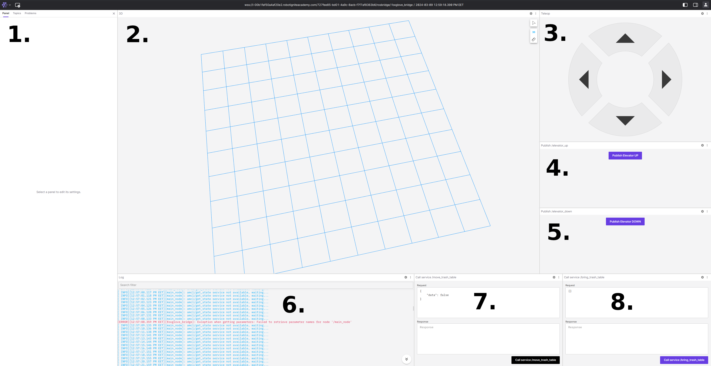

# ros_masterclass_final_project

ROS Masterclass 2023 - final project "Table picker robot"

**Version:** *ROS2 - Humble*

**Important:** This project works only on the real robot for now. So, you should be connected to the real Table Picker robot offered by TheConstructSim.


## Description
Thei main goal of this repo is to show knowledge gained during the Masterclass and show ability
to independently develop deployabe sofware on the real robot to solve real world tasks.
There were following sub tasks given to solve for this project to prove knowledge:
1. Setup Nav2 for the robot so it can localize itself and do path planning
2. Create a program that detects the trash table based on the table's legs separation. 
The robot must be able to find the shelf anywhere in Starbots.
3. Based on the detected trash table, write a program that controls the robot to go underneath the table, 
exactly in the middle, and lifts the elevator to pick the table up.
4. Once the Nav2 goal is sent and the robot arrives to the back room, 
write a program that commands the robot to drop the table by lowering 
the elevator and reversing out of the trash table.
5. Create a web application to control the whole process.
6. Containerize your project so that it can easily be deployed in any machine. (Because of technical reasons
that docker was not available in ROSject, this task was not completed.)
7. Create complete documentation for your project and for the Masterclass Final Project Presentation.


TODO: For more information see presentation `???`!


## Installation
```
cd <path/to/your/ros_ws>
git clone -b real https://github.com/Hercogs/ros_masterclass_final_project.git src/ros_masterclass_final_project
rosdep update
rosdep install --ignore-src --default-yes --from-path src
colcon build
```


## Launching the project
Launching this project consists of multiple steps, so it is easier to debug:
1. To launch ROS2 navigation stack for real robot use following command:
    `source src/ros_masterclass_final_project/scripts/start_path_planning.bash`
Initialize robot pose with *Rviz*, which should open automatically.
2. To launch table detection process use following command:
    `source src/ros_masterclass_final_project/scripts/start_table_detection.bash`
3. To launch web socket for webpage, use following command: 
   `source src/ros_masterclass_final_project/scripts/foxglove_bridge.bash`
   Execute: `rosbridge_address` to get websocket address, which later should be used to connect in webpage.
4. To launch webpage, execute: 
   `docker run --rm -p "8080:8080" -v src/ros_masterclass_final_project/foxglove-layout.json:/foxglove/default-layout.json ghcr.io/foxglove/studio:latest`
   Webpage will be accessible in your browser at [localhost:8080](http://localhost:8080/). Make connection using `rosbridge_address`
   from step 3. More information, how to use it: [foxglove](https://foxglove.dev/).


### Webpage interface
Webpage should look like below:



1. Setting panel
2. 3D space - for map. lidar, images e.c. data
3. Teleop panel, which allows to move robot
4. Topic publisher - lifts elevator
5. Topic publisher - move down elevator
6. Log panel - contains logs from ROS
7. Service caller - move table to the back room
8. Service caller - bring back table from back room
